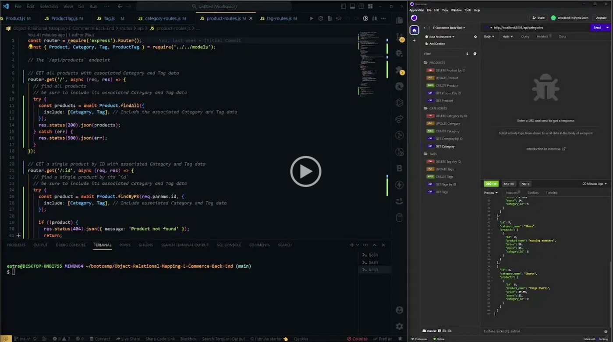
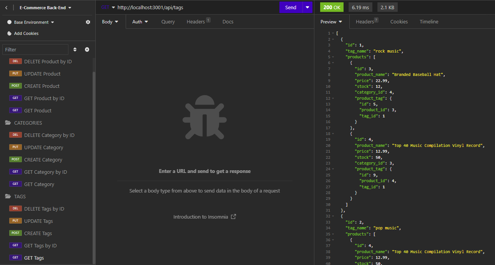
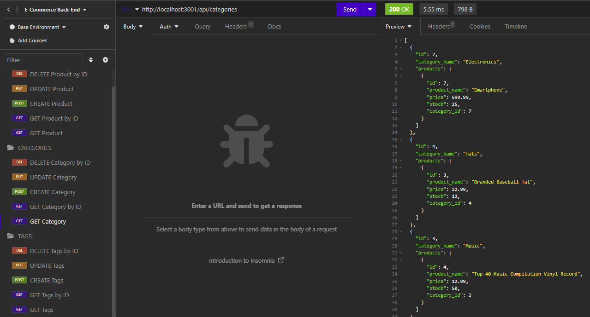
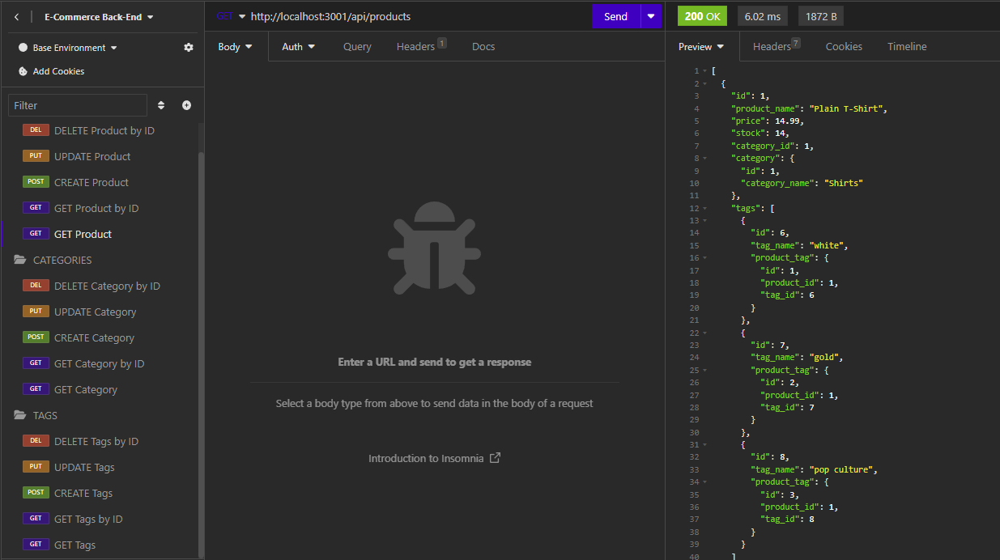
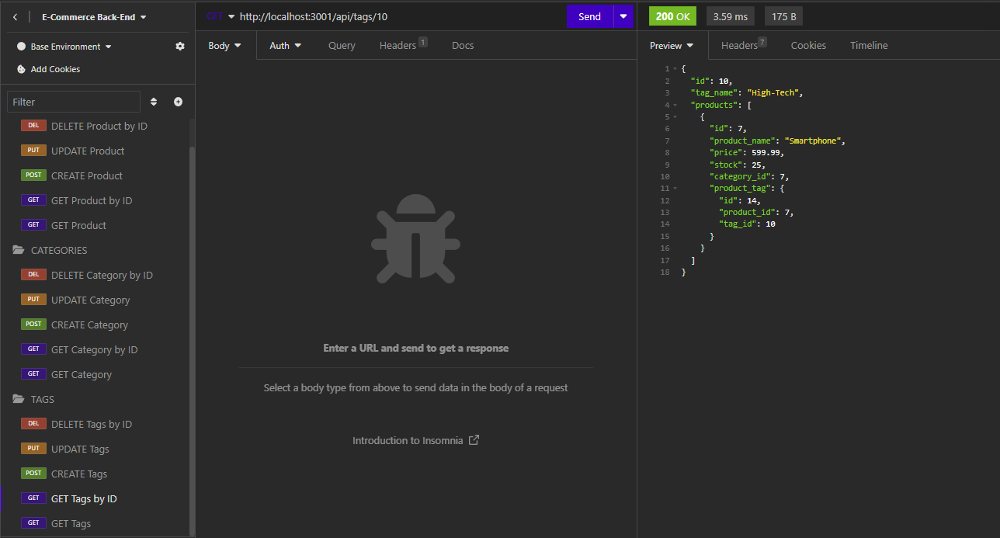
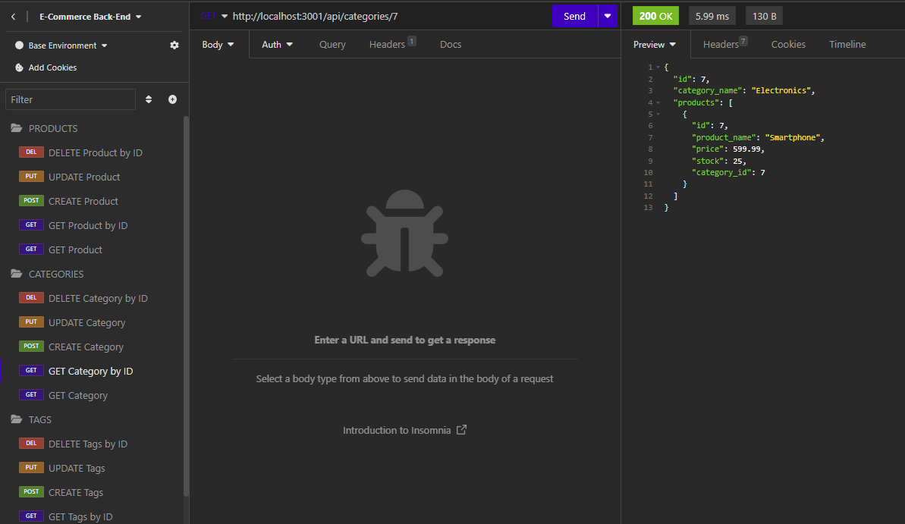
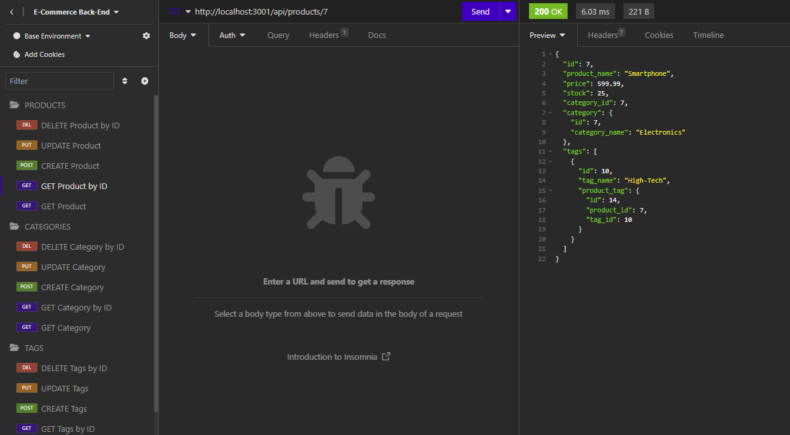
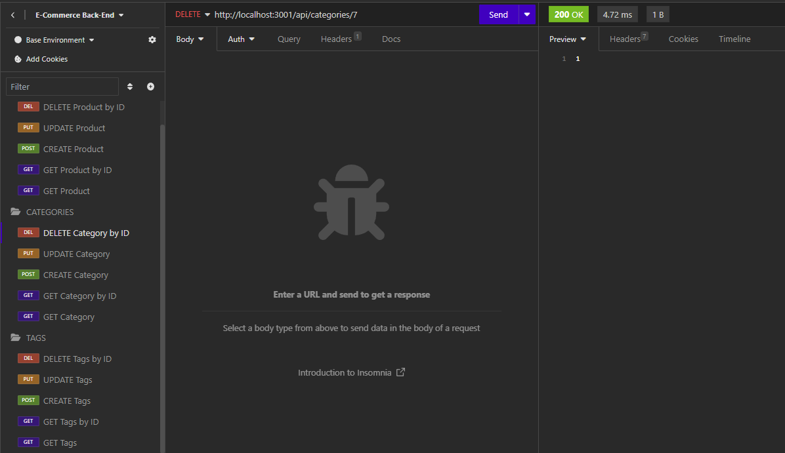
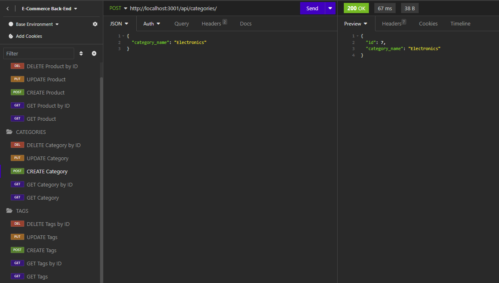
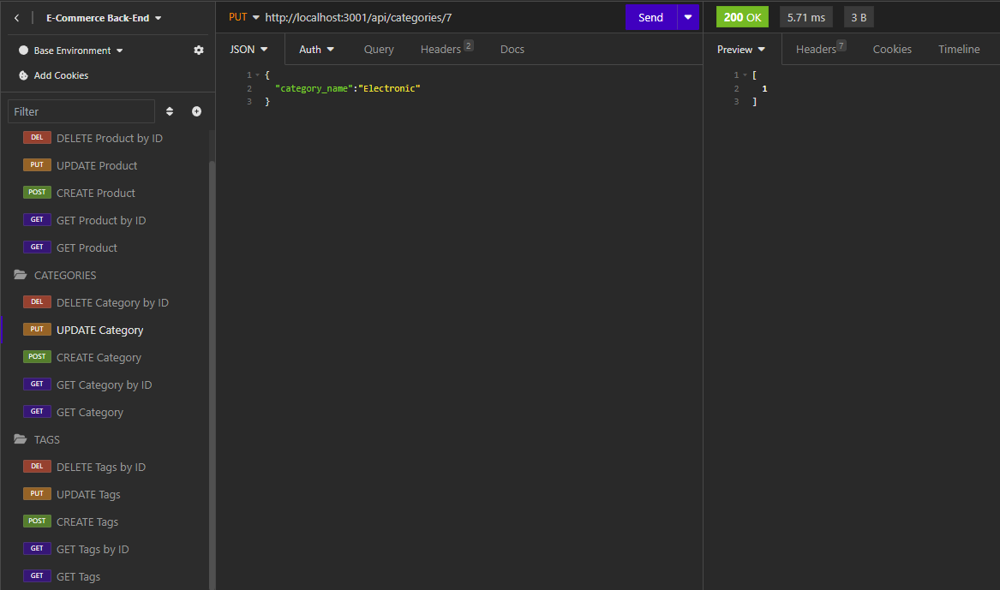

# Object-Relational-Mapping-E-Commerce-Back-End

## Description
This project is a back-end solution for an e-commerce website that utilizes the latest technologies to manage products, categories, and tags. It is designed for use by a manager at an internet retail company to compete effectively with other e-commerce businesses. The back end is built using Express.js and Sequelize, connecting to a MySQL database.

## User Story

```md
AS A manager at an internet retail company
I WANT a back end for my e-commerce website that uses the latest technologies
SO THAT my company can compete with other e-commerce companies
```

## Acceptance Criteria

```md
GIVEN a functional Express.js API
WHEN I add my database name, MySQL username, and MySQL password to an environment variable file
THEN I am able to connect to a database using Sequelize
WHEN I enter schema and seed commands
THEN a development database is created and is seeded with test data
WHEN I enter the command to invoke the application
THEN my server is started and the Sequelize models are synced to the MySQL database
WHEN I open API GET routes in Insomnia for categories, products, or tags
THEN the data for each of these routes is displayed in a formatted JSON
WHEN I test API POST, PUT, and DELETE routes in Insomnia
THEN I am able to successfully create, update, and delete data in my database
```

## Link to Google Drive

  The following video shows an example of the application being used from the command line:

  [](https://drive.google.com/file/d/1iBLlETpW93i4KBFVGZxJ037EBb45NSXx/view?usp=sharing)

  ## Screenshot

  The following screenshots shows the application's GET routes to return all categories, all products, and all tags being tested in Insomnia:







The following screenshots shows the application's GET routes to return a single category, a single product, and a single tag being tested in Insomnia:







The following screenshots shows the application's POST, PUT, and DELETE routes for categories being tested in Insomnia:






  
  ## Table of Contents
  - [Description](#description)
  - [User Story](#user-story)
  - [Acceptance Criteria](#acceptance-criteria)
  - [Link to Google Drive](#link-to-google-drive)
  - [Screenshot](#screenshot)
  - [Installation](#installation)
  - [Usage](#usage)
  - [License](#license)
  - [Questions](#questions)

  ## Installation
  Clone the Repository:

  Clone this repository to your local machine using your preferred method (HTTPS or SSH):

  git clone https://github.com/yourusername/e-commerce-backend.git

  Navigate to the Project Directory:<br>
  cd e-commerce-backend

  Install Dependencies:<br>
  Install the project's dependencies using npm:<br>
  npm install

  Set Up the Database:<br>
  Create a .env file in the project root directory and configure your database connection by adding the following lines:
  DB_NAME='your_database_name'
  DB_USER='your_database_username'
  DB_PASSWORD='your_database_password'

  Run the Schema and Seed Commands:<br>
  Execute the following commands to create the database and seed it with sample data:<br>
  npm run schema
  npm run seed

  ## Usage
  Once you have completed the installation steps, you can start using the e-commerce backend:

  Start the Server:<br>
  Run the server by executing the following command:<br>
  npm start

  The server will start and be available on http://localhost:3001.

  API Routes:<br>
  The API provides several routes for managing categories, products, and tags. You can access these routes using tools like Insomnia, Postman, or by making HTTP requests from your applications.

  GET Requests:<br>
  Fetch data from the API for categories, products, and tags.

  POST Requests:<br>
  Create new categories, products, and tags.
  PUT Requests: Update existing categories, products, and tags.
  DELETE Requests: Remove categories, products, and tags.

  Customization:<br>
  You can customize the provided sample data in the seed files and the functionality to suit your specific e-commerce needs.

  ## License
[](https://opensource.org/licenses) This project is licensed under the MIT License.

 ## Questions
If you have any questions or encounter any issues, please feel free to [open an issue](https://github.com/mxrtinee/Object-Relational-Mapping-E-Commerce-Back-End/issues) or contact me directly:<br>
GitHub: [Mxrtinee](https://github.com/Mxrtinee)<br>
Email: [hello@martinestrada.dev](mailto:hello@martinestrada.dev)